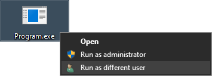
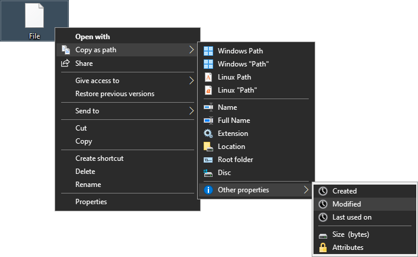
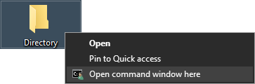
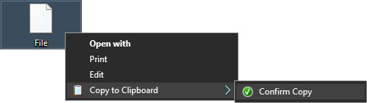
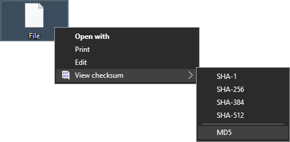
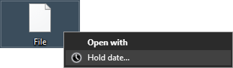

<h1 align=center>
	
	 
	CORSE
</h1>

	　　　<a href="https://codeclimate.com/github/kubinka0505/CORSE">

## Description 📝
Collection of [Windows Registry](https://en.wikipedia.org/wiki/Windows_Registry) entry files containing file explorer context menu extensions. 🗃️

---

## Extensions 🗃️
| № | Name | Description | Preview |
|:-:|:-:|:-|:-:|
| 01 | [`Run as User`](Files/Extensions/Run_as_User) | Famous `set __COMPAT_LAYER=RunAsInvoker` line implemented as an extension. |  |
| 02 | [`Copy as Path`](Files/Extensions/Copy_as_Path)1 | Copy various path properties of the selected file or directory instantly. |  |
| 03 | [`Open CMD Here`](Files/Extensions/Open_CMD_Here) | Allows you to open `CMD.exe` in any directory or drive. |  |
| 04 | [`Copy Contents`](Files/Extensions/Copy_Contents) | Copies file contents to user clipboard without opening requirement. |  |
| 05 | [`View Checksum`](Files/Extensions/View_Checksum)1 | Show certain file checksum as command window with copy prompt. |  |
| 06 | [`Hold Date`](Files/Extensions/Hold_Date)1 | Keeps selected file dates intact BEFORE command prompt window is `Enter`. Does NOT work with files containing apostrophe in name. (`'`) |  |

1 - requires [PowerShell](https://wikipedia.org/wiki/PowerShell)

---

### Variables 📝
A brief [documentation](https://learn.microsoft.com/en-us/windows/win32/shell/context-menu).

| № | Name (`CommandFlags`) | Description | Parameters |
|:-:|:-|:-|:-|
| 01 | Default | | Safe display text - visible if `MuiVERB` resource fails to load.  ℹ️ Supports context menu keyboard shortcut underlines. - (`&x` for <kbd>X</kbd>, etc.) |
| 02 | `MuiVERB` | Resource display text. | Text `@<Resource>,-<ID>` |
| 03 | `Icon` | Display icon. | `*(.ico/.exe)` `<Resource>,-<Index>` |
| 04 | `HasLUAShield` (`16`) | **Adds small UAC shield** to icon. | |
| 05 | `AppliesTo` | Curated lists of supported file extensions. | `System.FileExtension:=.ext OR ...` |
| 06 | `MultiSelectModel` | Specifies how many files (arguments) the option can handle. | `Single` = 1 `Player` = Infinity `Document` = up to 100 (each is a separate window) |
| 07 | `Position` | Placement of text in context menu. | `Top` `Bottom` |
| 08 | `SeparatorBefore` (`8`)| Adds separator before option label. | |
| 09 | `SeparatorAfter` (`1024`) | Adds separator after option label. | |
| 10 | `ExtendedSubCommandsKey` | Path to cascading menu keys. | — |
| 11 | `Extended` | Make extension available **only when <kbd>SHIFT</kbd>** key is pressed. | |
	
### Useful links and software 🔗
| № | Name | Description |
|:-:|:-:|:-:|
| 01 | [**`OmegaT-Windows`**](https://github.com/Belarus/OmegaT-Windows/tree/master/Windows/source/8/mui/Windows/System32/be-BY) | Decompiled **Windows 8** **MUI verbs** resource stringtables. 📚 |
| 02 | [**IconsExtract**](https://www.nirsoft.net/utils/iconsext.html) | Utility for extracting icons from resource files. 🖼️ | 
| 03 | [**Exported `System32` icons archive**](https://github.com/kubinka0505/CORSE/raw/master/Files/System32_DLL_Icons.zip) | An archive containing `16x16` resource icons. 🖼️ ℹ️ Scaled to a higher resolution for workflow enhancement. ℹ️ An alternative for `IconsExtract`. |
| 04 | [`System` attributes](https://learn.microsoft.com/en-us/previous-versions//ff521735(v=vs.85)#system) | Useful for `AppliesTo` parameter. |
| 05 | [Advanced Query Syntax](https://learn.microsoft.com/pl-pl/windows/win32/lwef/-search-2x-wds-aqsreference#desktop-search-syntax) | Syntax for `AppliesTo` parameters. |
| 06 | [File Type Registration](https://windowssucks.wordpress.com/file-type-registration) | More parameters, **mostly undocumented.** ⚠️ |<h1 align=center> |